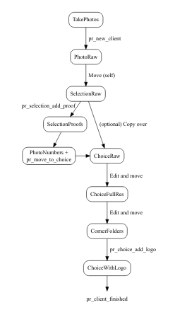

> NOTE: This project is still in development, code may not run. Please wait until a released version is created.

# pr-project: Commands to streamline Phoenix Rising projects

These commands are to help manage photography projects for [Phoenix Rising](http://www.sheisphoenixrising.com/).

# Installation

First step is to install [Git](https://git-scm.com/downloads), `rename` (paste
and run this command in the terminal: `brew install rename`), and `imagemagick`
(paste this in the terminal `brew install imagemagick`). Then to install these
programs, open up a terminal and run these commands:

```bash
# Download pr-projects
git clone https://github.com/lwjohnst86/pr-project.git ~/pr-project 

# install it!
sh ~/pr-project/bin/pr_install.sh
```

Next, set up the configuration file. Open it by running this command for Mac OSX:

```bash
open -e ~/.pr_config.txt
```

Or in Linux:

```bash
nano ~/.pr_config.txt
```

# Usage

The following commands are found in the pr-projects program (with more detail 
about them in the next section)

- `pr_new_client`: Create a folder and file structure for a new client.
- `pr_selection_add_proof`: Add a watermark to the photos to indicate they are
proofs before sending to client for them to choose their picks.
- `pr_move_to_choice`: Move the clients chosen photos into the `Photos/choice/raw/` folder.
- `pr_choice_add_logo`: Shrinks and adds the logo of the company to the 
`bottom_right`, `bottom_left`, `top_right`, and `top_left` corners of the chosen
photos.
- `pr_move_to_socialmedia`: Move the photographers chosen photos (from the
`choice/` or `selection/` photos) into the master company folder for
branding/marketing purposes. <!-- TODO confirm this -->
- `pr_client_finished`: Once the contract has been completed, package and
compress the client folder to archive.

Commands to update the pr-project program, just run this command!

```bash
pr_update_program
```

## More details about use

For any new client, you'll want to run the `pr_new_client` command. This will 
create a new folder with the following folders and files:

```
JimmyTimmy/
├── Documents/
│   ├── Contract.docx
│   ├── Model-Release-Form.docx
│   └── Visioning.txt
└── Photos/
    ├── client-choice/
    │   ├── full-res/
    │   │   ├── bottom-left/
    │   │   ├── bottom-right/
    │   │   ├── top-left/
    │   │   └── top-right/
    │   ├── raw/
    │   ├── with-logo/
    │   ├── photo-numbers-for-branding.csv
    │   └── photo-numbers-from-selection.csv
    ├── logo/
    │   └── logo.png
    ├── photographer-selection/
    │   ├── proofs/
    │   └── raw/
    └── raw/

```
<!-- use: tree filepath/ -avFn --dirsfirst > file_structure.txt -->

See the section "Description of each folder" for more details about each of the
folders and specific actions to take for them.

Next you would use the command `pr_move_to_choice`. I would recommend in the
terminal to first run this command:

This command takes the photo numbers the client has chosen (found in the
`photo-numbers-from-selection.csv` file; each set of numbers must be separated
by a comma and on only one line).

# Workflow description



## Description of each folder for workflow:

- Under `Photos/`:
    - `raw/`: The folder with all photos taken from the session or sessions of a
    specific contract (create a new client folder if a client comes for other
    sessions after the contract has completed). Photographer selects photos
    they think are the best for the client and copies them into
    `photographer-selection/raw/`.
    - `photographer-selection/`:
        - `raw/`: All photos that the photographer chooses from the `raw/`
        that will be sent to the client for final choices. When you run the
        `pr_selection_add_proof` command, the photos in this folder will be
        copied into the `proofs/` folder and a proof mark is added to those
        photos.
        - `proofs/`: These are photos with a watermark "proof" photos to be sent
        to the client to make their final choice. The photos in this folder
        temporary/non-permanent. Everytime `pr_selection_add_proof` command is
        run, these photos *get deleted*.
    - `client-choice/`: These are the photos that were chosen by the client from
    the selection that the photographer decided on.
        - `raw/`: Photos that were chosen from the client and moved over from
        the `photographer-selection/raw/`. From here, photos are opened up in
        [RawTherapee](http://rawtherapee.com/), edited, and saved over into the
        `full-res/` folder.
        - `full-res/`: Contains the edited photos that will eventually be sent
        to the client and also converted into social media form with a logo
        attached. Which corner the logo will be put in is decided by moving the
        photos into their respective corner folder (`bottom-right`,
        `bottom-left`, `top-right`, `top-left`).
        - `low-res/`: Files from `full-res` are converted into a smaller form
        (~2048 pixels length wise) using `pr_choice_convert_lowres` and moved to
        this folder. From here they are moved into either `bottom-right/`,
        `top-left/`, etc folders depending on where the logo will go.
        - `with-logo/`: Using the `pr_choice_add_logo` command, moves all
        `full-res/` photos into the `with-logo/` folder, shrinking them to about
        2048 pixels on the longest side, and adds a logo on the corner dictated
        by which folder the photo is found in (e.g. logo on bottom right for
        photos in the `bottom-right/` folder.)
    - `logo/` folder contains the logo.png file to add to the photos.

